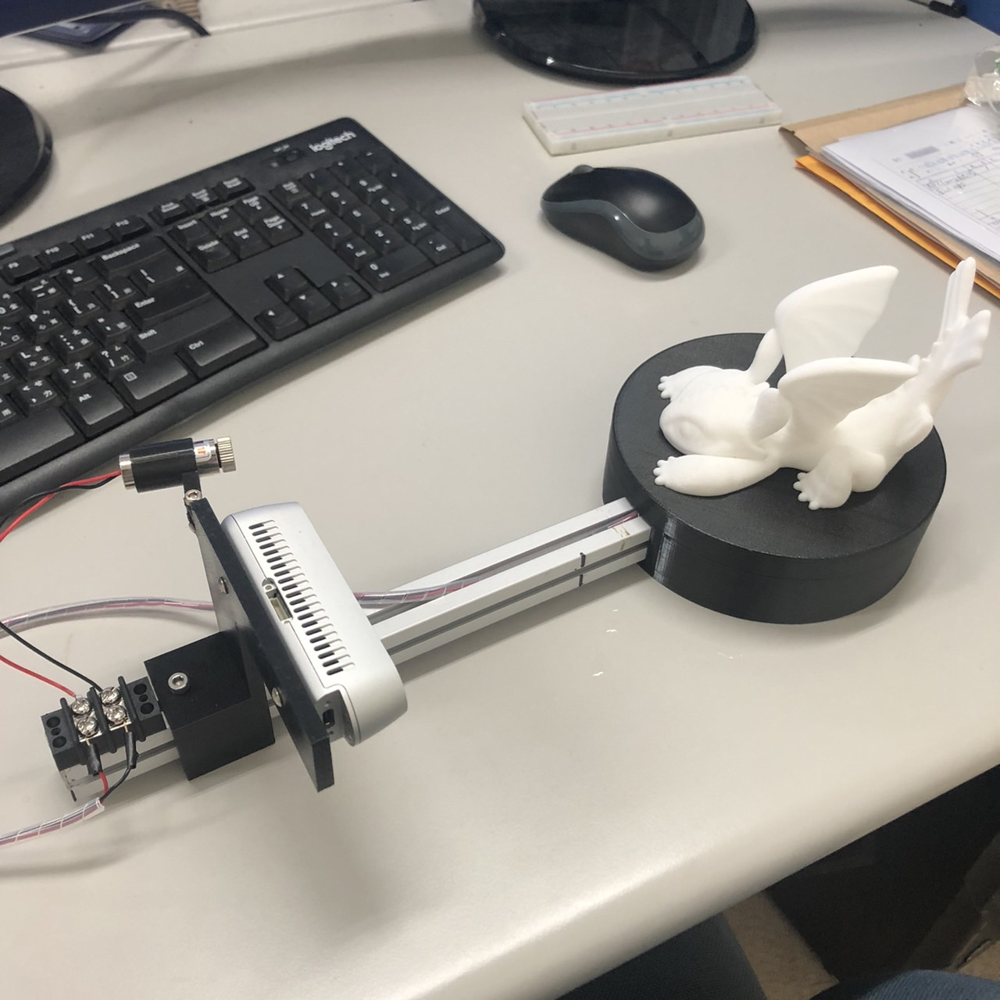

# 3D_scanner_project
### For backup program

## Hardware requirements
* RealSense D435i
* Arduino
* Rotary platform
* Line Laser

## Mechanism
<br/>
## Demo


作者：SimpleBK
链接：https://www.jianshu.com/p/20131a0105f5
来源：简书
著作权归作者所有。商业转载请联系作者获得授权，非商业转载请注明出处。

## Demo from D435i
```
cd d435i/
python3 vis_pointcloud2.py
```
